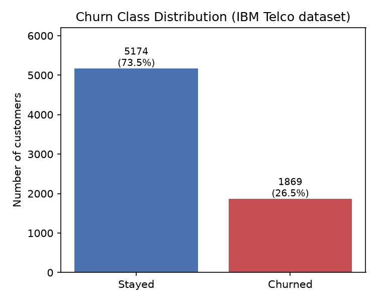
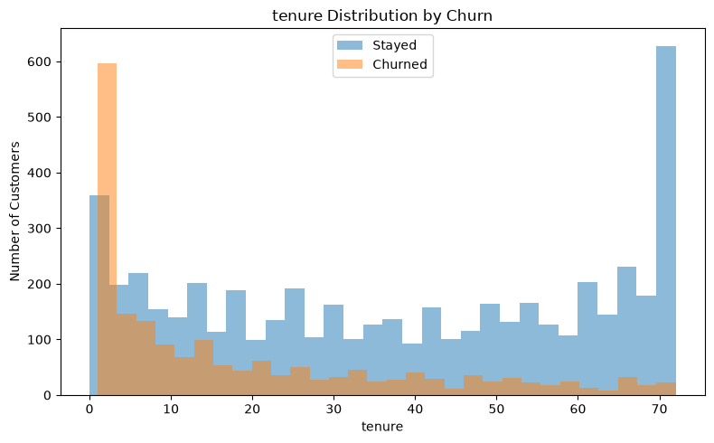
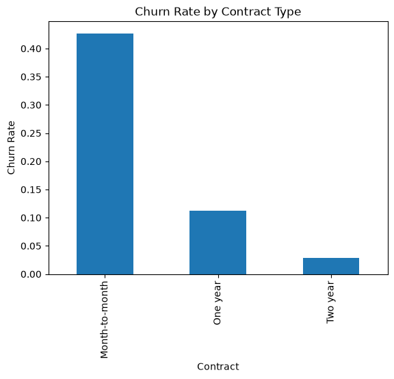
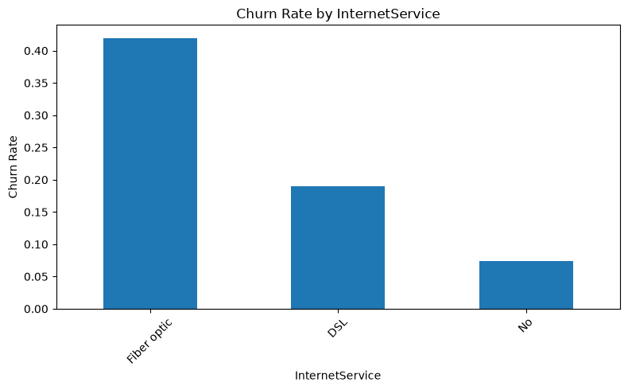
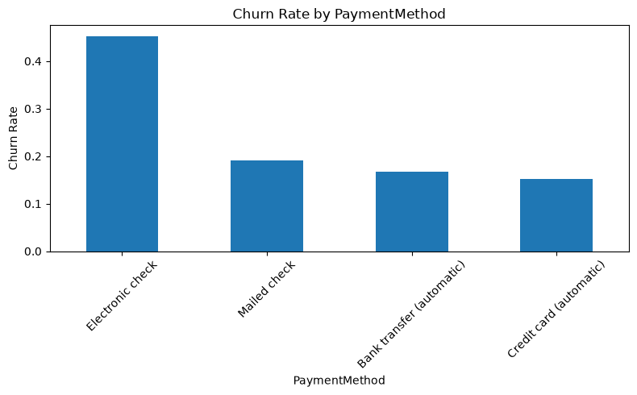
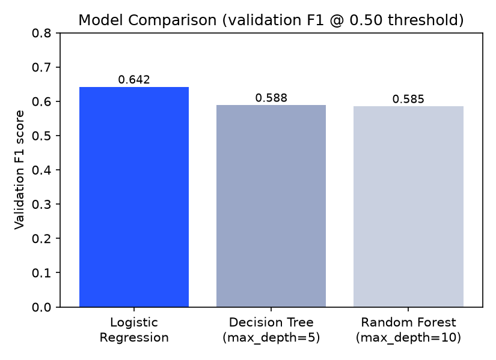
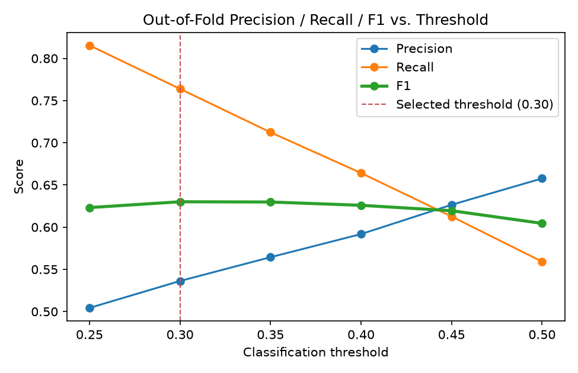
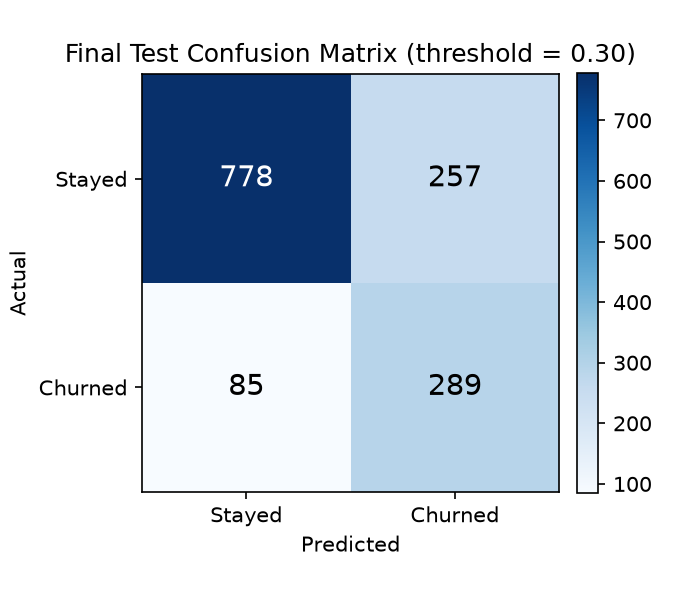

# Customer Churn Prediction — Telecom Retention Risk Model

An end-to-end churn-prediction system for a telecom business: a logistic regression
model that estimates the probability a customer will cancel their service, wrapped in a
FastAPI backend and a small retention-focused frontend. This project is framed around a
business decision, not just a modeling exercise — the write-up below documents the
experiments, the dead ends, and the reasoning behind every modeling choice, including
ones that didn't make it into the final model.

## Table of Contents

1. [Business Problem](#business-problem)
2. [Why Churn Prediction Matters](#why-churn-prediction-matters)
3. [Dataset](#dataset)
4. [Project Architecture](#project-architecture)
5. [Data Cleaning and Preprocessing](#data-cleaning-and-preprocessing)
6. [EDA Insights](#eda-insights)
7. [Modeling Experiments](#modeling-experiments)
8. [Why Logistic Regression Won](#why-logistic-regression-won)
9. [Why Accuracy Alone Was Not Sufficient](#why-accuracy-alone-was-not-sufficient)
10. [Precision vs. Recall](#precision-vs-recall)
11. [Classification Threshold Tuning](#classification-threshold-tuning)
12. [Why Stratified K-Fold Was Introduced](#why-stratified-k-fold-was-introduced)
13. [Final Model](#final-model)
14. [Final Performance](#final-performance)
15. [Confusion Matrix Interpretation](#confusion-matrix-interpretation)
16. [Lessons Learned](#lessons-learned)
17. [API](#api)
18. [Running Locally](#running-locally)
19. [Static Demo (GitHub Pages)](#static-demo-github-pages)
20. [Testing](#testing)
21. [Example Prediction Request/Response](#example-prediction-requestresponse)
22. [Repository Structure](#repository-structure)
23. [Limitations](#limitations)
24. [Future Improvements](#future-improvements)

---

## Business Problem

**Can we identify customers who are at high risk of leaving a telecom company early
enough for the business to intervene with retention actions?**

Churn prediction is not graded on accuracy alone — it's graded on the cost of getting
each type of mistake wrong:

- **False negative** (predict "stays", customer actually churns): the business loses
  the customer with no chance to intervene. This is the expensive mistake.
- **False positive** (predict "churns", customer was actually loyal): the business
  spends a retention call, discount, or offer on someone who didn't need it. Wasteful,
  but far cheaper than losing a customer outright.

Because of this asymmetry, **this project explicitly prioritizes recall (catching
churners) over raw accuracy**, and the classification threshold was tuned rather than
left at the sklearn default of 0.50. The final threshold is **0.30**.

## Why Churn Prediction Matters

Acquiring a new telecom customer is significantly more expensive than retaining an
existing one, and churn compounds silently — by the time a customer cancels, the
opportunity to intervene has already passed. A model that flags at-risk customers
_before_ they leave turns churn from a reactive loss into a proactive retention
opportunity (a discount, a support call, a plan change) — but only if it's tuned to
actually catch those customers rather than optimize a generic accuracy number.

## Dataset

- **Source:** IBM Telco Customer Churn dataset ([`data/raw/data.csv`](data/raw/data.csv), not committed to git — see [Running Locally](#running-locally)).
- **Size:** 7,043 customers, 21 columns (19 features + `customerID` + the `Churn` target).
- **Target:** `Churn` (`Yes`/`No`), mapped to `1`/`0`.
- **Class balance:** 5,174 stayed (73.5%) vs. 1,869 churned (26.5%) — a real-world
  imbalance, which shapes several decisions later in this document.



Every feature was interpreted in business terms before being treated as a modeling
input — e.g. `Contract` describes a commitment structure (month-to-month vs. one/two
year lock-in), `PaymentMethod` describes billing friction, and the service add-on
columns (`OnlineSecurity`, `TechSupport`, etc.) describe how embedded a customer is in
the provider's ecosystem. This mattered later: several "weak" features turned out to be
weak precisely because they were proxies for stronger ones (see
[EDA Insights](#eda-insights)).

## Project Architecture

```
Raw CSV → sklearn Pipeline (ColumnTransformer: OneHotEncoder + StandardScaler) → LogisticRegression
                                                                                        │
                                                                              churn_logistic_model.joblib
                                                                                        │
                                                        ┌───────────────────────────────┴───────────────────────────────┐
                                                        │                     FastAPI (api/main.py)                     │
                                                        │   loads pipeline + threshold once at startup, exposes         │
                                                        │   /health and /predict, serves the frontend as static files   │
                                                        └───────────────────────────────┬───────────────────────────────┘
                                                                                        │
                                                                       frontend/index.html (retention dashboard UI)
```

The key design choice: **all preprocessing lives inside the saved sklearn `Pipeline`**.
The API and tests never one-hot encode or scale anything themselves — they hand the
pipeline a raw customer record and it does exactly what it did at training time. This
is what guarantees inference-time preprocessing can't silently drift from
training-time preprocessing.

There are two ways to run the frontend, for two different purposes:
[`frontend/`](frontend/) is served by FastAPI and calls the live API above; [`docs/`](docs/)
is a fully static clone for GitHub Pages that runs the same model's fitted weights
directly in JavaScript, with no backend at all — see
[Static Demo (GitHub Pages)](#static-demo-github-pages).

## Data Cleaning and Preprocessing

Steps actually applied, in order (see [`notebooks/02_EDA.ipynb`](notebooks/02_EDA.ipynb)):

1. **`TotalCharges` type fix.** It's stored as a string in the raw CSV (`object`
   dtype), not numeric — `pd.to_numeric(..., errors="coerce")` exposed **11 blank
   values**, all belonging to customers with `tenure == 0`. These are brand-new
   customers who haven't been billed yet, so the blanks are a legitimate zero, not
   missing data — they were filled with `0` rather than dropped or imputed with a mean.
2. **Dropped `customerID`.** It's a unique identifier with no predictive signal;
   keeping it would either do nothing (if excluded from the encoder) or let the model
   latent-memorize training rows (if one-hot encoded), so it's removed before modeling.
3. **Target encoding.** `Churn` (`"Yes"`/`"No"`) mapped to `1`/`0`.
4. **Categorical encoding.** 16 categorical columns — including `SeniorCitizen`, which
   is stored as `0`/`1` in the raw data but is a binary indicator, not a magnitude, so
   it was treated as categorical rather than scaled — were one-hot encoded with
   `OneHotEncoder(handle_unknown="ignore")`. The `handle_unknown="ignore"` setting also
   means the deployed API can't crash on a category it didn't expect; see
   [API](#api) for why request validation still rejects those explicitly instead of
   silently ignoring them.
5. **Numerical scaling.** `tenure`, `MonthlyCharges`, `TotalCharges` were standardized
   with `StandardScaler`.
6. **`ColumnTransformer` + `Pipeline`.** Both encoders are wrapped in a single
   `ColumnTransformer`, which is itself the first step of a `Pipeline` whose second step
   is the classifier. Fitting, predicting, and saving all happen on this one object —
   there is no hand-rolled preprocessing code to keep in sync between training and
   inference.

## EDA Insights

Full feature-by-feature exploration is in
[`notebooks/01_data-understanding.ipynb`](notebooks/01_data-understanding.ipynb). The
goal throughout was to form **hypotheses**, not conclusions — a higher churn rate
alongside a feature is a reason to ask "why," not proof that the feature _causes_
churn.

**Tenure** shows the clearest pattern in the dataset: churn is heavily concentrated in
a customer's first few months and drops off sharply after that, while long-tenure
customers (60+ months) rarely churn.



**Contract type** is one of the strongest categorical signals — month-to-month
customers churn far more than one- or two-year contract holders, which lines up with
the obvious hypothesis that a lock-in period removes the easiest opportunity to leave.



**Internet service** is similarly strong — fiber optic customers churn substantially
more than DSL or no-internet customers. The notebook flags this as a question rather
than an answer (is it price? reliability? competition in fiber markets?), since EDA
alone can't distinguish those explanations.



**Payment method** shows automatic payment methods (bank transfer, credit card) churning
noticeably less than manual ones, and electronic check standing out as the highest-churn
method — plausibly a proxy for a less "locked-in," more price-sensitive customer
segment, though the EDA can't confirm that directly.



Other notable observations from the notebook:

- **`OnlineSecurity`, `OnlineBackup`, `DeviceProtection`, `TechSupport`** all show the
  same pattern: customers _without_ the add-on churn more, but so do customers with "No
  internet service" — who can't have the add-on at all and also churn the least. This
  hinted that some of the apparent effect of these features is confounded with
  `InternetService` and tenure rather than the add-on itself.
- **`MonthlyCharges` and `TotalCharges`** don't separate churned from retained customers
  cleanly on their own — `TotalCharges` in particular is heavily confounded with tenure,
  since it mechanically accumulates the longer someone stays.
- **`gender`, `Partner`, `PhoneService`** showed only small differences in churn rate in
  isolation — flagged as likely-weak features rather than removed outright (see
  [Modeling Experiments](#modeling-experiments) for why deleting them was tested and
  rejected).
- **`SeniorCitizen` and `Dependents`** showed larger, more actionable gaps — senior
  citizens and customers without dependents both churned meaningfully more.

## Modeling Experiments

All experiments below used the same train/validation/test split (60/20/20, stratified
on `Churn`; 4,225 / 1,409 / 1,409 customers) before Stratified K-Fold was introduced
later in the project (see [Why Stratified K-Fold Was Introduced](#why-stratified-k-fold-was-introduced)).

**Baseline — Logistic Regression** (`max_iter=1000`, default 0.50 threshold):

| Metric    | Validation |
| --------- | ---------- |
| Accuracy  | 0.824      |
| Precision | 0.698      |
| Recall    | 0.594      |
| F1        | 0.642      |

**Manual feature engineering** — tested three hand-built features against the
hypotheses formed during EDA, all evaluated on the same validation split:

| Feature idea                              | Hypothesis                                             | Result                                                                                          |
| ----------------------------------------- | ------------------------------------------------------ | ----------------------------------------------------------------------------------------------- |
| `Fiber_MonthToMonth` (interaction flag)   | Fiber + month-to-month customers churn especially hard | Identical F1 to baseline — no added signal beyond `Contract` and `InternetService` individually |
| `AutomaticPayment` (grouped payment flag) | Automatic payment methods behave as one segment        | F1 0.640 — essentially no change                                                                |
| `tenure_squared` (nonlinear tenure term)  | Churn risk drops off nonlinearly with tenure           | F1 0.632, precision up but recall down — net worse for this project's priority                  |

None of these beat the plain baseline, which is a real (if less exciting) finding: the
linear model with the original features already captured most of the signal these
engineered features were trying to add.

**Permutation importance** (`n_repeats=20`, scored on validation F1) on the baseline
pipeline ranked features by how much validation F1 drops when that feature is shuffled:

| Rank | Feature                   | Importance    |
| ---- | ------------------------- | ------------- |
| 1    | `tenure`                  | 0.262         |
| 2    | `Contract`                | 0.142         |
| 3    | `InternetService`         | 0.117         |
| 4    | `PaymentMethod`           | 0.044         |
| 5    | `TechSupport`             | 0.040         |
| ...  | _(remaining 14 features)_ | 0.001 – 0.038 |

`tenure`, `Contract`, and `InternetService` dominate by a wide margin — consistent with
the EDA findings above.

**Testing whether "weak" features could be safely removed:** based on the permutation
ranking, the seven lowest-ranked features (`SeniorCitizen`, `Partner`, `gender`,
`Dependents`, `PhoneService`, `DeviceProtection`, `OnlineBackup`) were dropped and the
model retrained:

|                         | Validation F1 |
| ----------------------- | ------------- |
| Full feature set        | 0.642         |
| "Weak" features removed | 0.623         |

Removing them made the model **worse**, not better. This is an important negative
result — see [Lessons Learned](#lessons-learned).

**Decision Tree** — badly overfit at default settings (unlimited depth):

|                                                       | Train F1 | Validation F1 |
| ----------------------------------------------------- | -------- | ------------- |
| Unlimited depth (22 levels, 798 leaves)               | 0.997    | 0.518         |
| `max_depth=5` (best of a `{3,4,5,6,7,8,10,15}` sweep) | 0.623    | 0.588         |

**Random Forest** (100 trees) — the same overfitting pattern:

|                                                       | Train F1 | Validation F1 |
| ----------------------------------------------------- | -------- | ------------- |
| Unlimited depth                                       | 0.997    | 0.561         |
| `max_depth=10` (best of a `{3,5,7,10,15,None}` sweep) | 0.769    | 0.585         |



Even after tuning `max_depth` to fight the overfitting, neither tree-based model beat
the untuned logistic regression baseline (0.642) on validation F1.

## Why Logistic Regression Won

Not because it's the "correct" algorithm for churn prediction in general, but because,
**on this dataset, with this feature set, it validated better than the alternatives that
were actually tried** — and it did so without needing depth tuning to control
overfitting. Decision Tree and Random Forest both memorize the training set
almost perfectly (F1 ≈ 0.997) and only get competitive with heavy regularization
(shallow `max_depth`), and even then they landed several points of F1 below the plain
logistic regression baseline. Given the choice between a well-behaved linear model and
a heavily-constrained tree model that still trails it, the simpler model won on merit,
not by default.

## Why Accuracy Alone Was Not Sufficient

With a 73.5% / 26.5% class split, a model that predicts "No churn" for every single
customer would score **73.5% accuracy** while catching zero churners — the exact
opposite of this project's goal. The logistic regression baseline's 82.4% validation
accuracy looks reassuring in isolation, but at the default 0.50 threshold it was only
catching **59.4%** of actual churners (recall). Accuracy alone would have hidden that
gap completely; it took looking at precision, recall, and the confusion matrix directly
to see it.

## Precision vs. Recall

Mapped back to the business costs described in [Business Problem](#business-problem):

- **Recall** = of the customers who actually churn, what fraction does the model catch?
  Low recall means real churners slip through with no retention attempt at all.
- **Precision** = of the customers the model flags as at-risk, what fraction actually
  churn? Low precision means retention resources get spent on customers who were never
  going to leave.

Since a missed churner (lost revenue) was judged more costly than a wasted retention
offer (a call, a discount), **this project explicitly optimized for recall over
precision** — which is exactly why the classification threshold was tuned down from the
default rather than left at 0.50.

## Classification Threshold Tuning

The default threshold of 0.50 is not a modeling law — it's an arbitrary midpoint that
only makes sense when false positives and false negatives are equally costly, which
they aren't here. A first threshold sweep (on the single validation split) compared six
thresholds:

| Threshold | Precision | Recall | F1    |
| --------- | --------- | ------ | ----- |
| 0.30      | 0.534     | 0.791  | 0.638 |
| 0.35      | 0.567     | 0.743  | 0.644 |
| 0.40      | 0.594     | 0.703  | 0.644 |
| 0.45      | 0.630     | 0.647  | 0.639 |
| 0.50      | 0.698     | 0.594  | 0.642 |
| 0.55      | 0.721     | 0.497  | 0.589 |

At this stage, **0.35** was selected: it and 0.40 had nearly identical F1, but 0.35 gave
meaningfully higher recall (74.3% vs. 70.3%). A `class_weight="balanced"` variant of
logistic regression was also tested as an alternative way to push recall up (Precision
0.518 / Recall 0.824 / F1 0.636 at the default threshold) — higher recall, but precision
fell enough that the overall tradeoff was judged worse than a manually tuned threshold
on the standard model, so it wasn't adopted.

This 0.35 threshold turned out not to be the final answer — see the next section for
why.

## Why Stratified K-Fold Was Introduced

Evaluating the 0.35-threshold model on the **test** set for the first time produced a
result that didn't match the validation numbers it was chosen from:

|           | Validation (threshold 0.35) | Test (threshold 0.35) |
| --------- | --------------------------- | --------------------- |
| Precision | 0.567                       | 0.518                 |
| Recall    | 0.743                       | 0.586                 |
| F1        | 0.644                       | 0.550                 |

A 9-point F1 drop from validation to test is a red flag. The threshold — and, before
it, the choice between Logistic Regression, Decision Tree, and Random Forest — had all
been decided by repeatedly looking at the same single validation split. That's a form
of overfitting to the validation set itself: the more decisions you make by checking
one fixed sample, the more likely you are to pick something that fit that sample's
noise rather than the true underlying pattern.

The fix was **Stratified 5-Fold Cross-Validation**: `X_train` and `X_val` were merged
back into one development set (`X_dev`, 5,634 customers) and split five different ways,
each fold training on 80% and validating on the other 20%, preserving the churn class
ratio in every split. `cross_validate` gave a mean validation F1 of **0.604** across the
five folds — different from (and more trustworthy than) the original single-split F1 of
0.642, because it isn't tied to the luck of one particular split.

More importantly, `cross_val_predict` produced **out-of-fold (OOF) probabilities** —
every customer in `X_dev` gets a predicted probability from a fold that _didn't_ train
on them, so the threshold sweep below reflects genuinely held-out predictions across
the entire development set instead of one 1,409-row slice of it:

| Threshold | Precision | Recall    | F1        |
| --------- | --------- | --------- | --------- |
| 0.25      | 0.504     | 0.815     | 0.623     |
| **0.30**  | **0.536** | **0.764** | **0.630** |
| 0.35      | 0.564     | 0.712     | 0.630     |
| 0.40      | 0.592     | 0.664     | 0.626     |
| 0.45      | 0.627     | 0.613     | 0.620     |
| 0.50      | 0.658     | 0.559     | 0.604     |



**0.30** and 0.35 are statistically indistinguishable on F1 (0.6301 vs. 0.6298), but
0.30 delivers meaningfully higher recall (76.4% vs. 71.2%) — so 0.30 was selected as the
final threshold, revising the earlier single-split choice of 0.35.

## Final Model

- **Algorithm:** Logistic Regression (`max_iter=1000`, `random_state=42`)
- **Preprocessing:** `OneHotEncoder` (16 categorical columns) + `StandardScaler` (3
  numerical columns) inside a `ColumnTransformer`, wrapped in a `sklearn.Pipeline` with
  the classifier
- **Training data:** the full development set (`X_train` + `X_val` combined, 5,634
  customers) — refit after the cross-validation study confirmed the threshold choice
- **Threshold:** 0.30 (stored alongside the model in `models/model_metadata.json`, not
  hardcoded in application code)
- **Artifacts:** [`models/churn_logistic_model.joblib`](models/churn_logistic_model.joblib) (the fitted pipeline), [`models/model_metadata.json`](models/model_metadata.json) (threshold + metadata)

## Final Performance

Evaluated once on the held-out test set (1,409 customers untouched by training or
cross-validation) at the final threshold of 0.30:

| Metric    | Value  |
| --------- | ------ |
| Accuracy  | 0.7573 |
| Precision | 0.5293 |
| Recall    | 0.7727 |
| F1        | 0.6283 |

This is close to the cross-validated OOF F1 of ~0.630 — a much smaller gap than the
9-point drop seen with the single-split methodology, which is itself evidence that the
CV-based approach generalizes better.

**A transparency note, since this is a learning project:** the test set was evaluated
twice over the course of development — once early on (at threshold 0.35, to sanity
check the single-validation-split model) and once as this final check (at threshold
0.30, after cross-validation). The first look at test-set performance is part of what
motivated introducing cross-validation in the first place. That means this final number,
while reassuringly close to the CV estimate, should be read as **informative rather than
a perfectly pristine, one-shot production benchmark** — a fully rigorous setup would
lock the test set away after a single final check. The close agreement between the OOF
CV estimate and this test result is reassuring, but it isn't the same guarantee as a
test set that was truly untouched until the very end.

## Confusion Matrix Interpretation

```
                 Predicted: Stay   Predicted: Churn
Actual: Stay          778               257
Actual: Churn          85               289
```



- **289 actual churners correctly identified** — customers the business now has a
  chance to reach with a retention offer before they leave.
- **85 churners missed** — the false negatives this project cared most about
  minimizing; at the default 0.50 threshold this number would have been considerably
  higher.
- **257 loyal customers incorrectly flagged** — the accepted cost of the lower
  threshold: some unnecessary retention outreach to customers who were never leaving.
- **Recall ≈ 77%**: roughly three out of every four customers who actually churn are
  caught by this policy.
- **Precision ≈ 53%**: just over half of everyone flagged as at-risk actually churns —
  a deliberate tradeoff, not an oversight, given the cost asymmetry described in
  [Business Problem](#business-problem).

## Lessons Learned

- **Simpler models can outperform more complex ones.** Decision Tree and Random Forest
  both had more capacity than Logistic Regression and both overfit hard enough that,
  even after tuning, they lost to the simpler model.
- **Feature engineering should be evidence-driven, not speculative.** All three
  hand-built features (`Fiber_MonthToMonth`, `AutomaticPayment`, `tenure_squared`) were
  motivated by real EDA hypotheses, and all three failed to beat the baseline — a useful
  result that stopped further speculative feature-building.
- **Low permutation importance does not mean a feature is safe to delete.** Removing the
  seven lowest-ranked features by permutation importance made validation F1 _worse_
  (0.642 → 0.623), not better.
- **Accuracy is insufficient for an imbalanced target.** A trivial majority-class
  prediction gets 73.5% accuracy here while catching zero churners.
- **Precision and recall need to be connected to business cost**, not treated as
  abstract numbers to maximize — that connection is what justified moving the threshold
  at all.
- **Classification thresholds are a business decision as much as a modeling one.** 0.50
  is a default, not a rule.
- **A single validation split can give misleading confidence.** The first
  validation-to-test F1 gap (0.644 → 0.550) looked like a modeling failure; it was
  actually a methodology gap.
- **Cross-validation gives a materially more robust estimate of generalization** — the
  OOF-based threshold choice generalized to the test set far more consistently than the
  single-split choice did.

## API

Built with FastAPI around the saved pipeline ([`api/main.py`](api/main.py),
[`api/schemas.py`](api/schemas.py), [`src/churn_model.py`](src/churn_model.py)):

- **Loads the model once at startup**, not per-request (`ChurnModelService`, loaded in
  a FastAPI `lifespan` handler).
- **Loads the threshold from `models/model_metadata.json`** — it is never hardcoded in
  application code.
- **Accepts raw, unencoded customer fields.** The Pydantic request model
  (`CustomerFeatures`) mirrors the original dataset columns; the sklearn pipeline
  performs one-hot encoding and scaling internally, so the API layer never touches
  preprocessing logic.
- **Validates categorical fields against the categories the encoder was actually fit
  on** (`Literal` types copied from `encoder.categories_`), so a typo or unsupported
  category is rejected with a `422` instead of being silently absorbed by the
  underlying `OneHotEncoder(handle_unknown="ignore")`.
- **`GET /health`** — reports model status, model type, and the active threshold.
- **`POST /predict`** — returns:
  - `churn_probability` — raw model output, between 0 and 1
  - `prediction` — `0` or `1`, using the stored threshold
  - `label` — `"Likely to Churn"` / `"Likely to Stay"`
  - `threshold` — the decision threshold that was applied
  - `risk_category` — `Low` / `Medium` / `High`, a **fixed UI-only bucketing** of the
    probability for quick scanning (below the threshold = Low, at/above it up to 0.60 =
    Medium, 0.60+ = High). This is _not_ a second trained model, and it is not a causal
    claim about why a customer is at risk — see [Limitations](#limitations).
- Automatic OpenAPI/Swagger docs at `/docs` (and ReDoc at `/redoc`).
- A startup check asserts the request schema's fields exactly match the pipeline's
  expected input columns, so schema drift fails loudly at boot instead of silently at
  request time.

## Running Locally

**Requirements:** Python 3.12 (the project was built and tested against it; other
recent 3.x versions likely work but haven't been verified).

```bash
git clone https://github.com/loay07/customer-churn-prediction.git
cd customer-churn-prediction
python -m venv .venv

# macOS/Linux:
source .venv/bin/activate
# Windows (cmd/PowerShell):
.venv\Scripts\activate

pip install -r requirements.txt
```

The trained model and metadata are already committed under `models/`, so the API works
immediately without retraining anything. The raw dataset (`data/raw/data.csv`) is
**not** committed — download the
[IBM Telco Customer Churn dataset](https://www.kaggle.com/datasets/blastchar/telco-customer-churn)
and place it at `data/raw/data.csv` if you want to run the notebooks or regenerate the
report figures.

**Run the API + frontend:**

```bash
uvicorn api.main:app --reload
```

Then open:

- `http://127.0.0.1:8000/` — the churn-risk demo frontend
- `http://127.0.0.1:8000/docs` — interactive Swagger API docs

**Run with Docker instead:**

```bash
docker build -t churn-api .
docker run -p 8000:8000 churn-api
```

This builds a slim image from `requirements-api.txt` (runtime deps only — no
Jupyter/matplotlib/pytest) and serves the same API + frontend on port 8000.

## Static Demo (GitHub Pages)

GitHub Pages only serves static files — it can't run the FastAPI backend, so
`frontend/index.html` (which calls `POST /predict`) won't work if pushed there
as-is. [`docs/`](docs/) is a second, fully static version of the same UI built
specifically for that: **it runs the trained model's actual fitted
coefficients directly in JavaScript**, with no backend and no network request
at all.

This works because the final model reduces to simple math: one-hot encoding
is just a 0/1 lookup, `StandardScaler` is `(x - mean) / scale`, and
`LogisticRegression` is a dot product through a sigmoid. `docs/model.js`
evaluates exactly that formula, using the real weights in
`docs/model_params.js`.

- **[`docs/export_model_params.py`](docs/export_model_params.py)** loads the
  same `models/churn_logistic_model.joblib` the API uses and writes its
  coefficients, one-hot categories, and scaler mean/scale values to
  `model_params.js`. It does not retrain anything — it only re-expresses the
  existing fitted model for a JS runtime. Re-run it after retraining:
  ```bash
  python docs/export_model_params.py
  ```
- **[`docs/model.js`](docs/model.js)** is the generic scoring function that
  reads those parameters and computes a probability.
- **[`tests/test_docs_model_js.py`](tests/test_docs_model_js.py)** runs the
  *actual* `docs/model.js` file through Node and asserts it matches
  `ChurnModelService`'s output exactly (within floating-point tolerance) —
  this is what keeps the JS reimplementation honest against the real
  pipeline instead of silently drifting from it. It's skipped automatically
  if Node.js isn't installed.

**To publish it:** push this repo to GitHub, then in the repo's Settings →
Pages, set Source to "Deploy from a branch", branch `main`, folder `/docs`.
GitHub will publish `docs/index.html` at
`https://<your-username>.github.io/<repo-name>/`. No build step, no Actions
workflow, and no hosting cost.

## Testing

```bash
pip install -r requirements.txt   # includes pytest and httpx
pytest
```

[`tests/test_model.py`](tests/test_model.py) covers the inference layer directly:
model/metadata load correctly, the stored threshold is 0.30, predicted probabilities
fall in `[0, 1]`, the threshold is applied consistently, a clearly low-risk profile
scores lower than a clearly high-risk one, and a missing required field raises a clear
error rather than a confusing one from deep inside sklearn.

[`tests/test_api.py`](tests/test_api.py) covers the HTTP layer: `/health` reports the
right threshold and model type, a valid `/predict` request returns a well-formed
response, and invalid requests (missing field, an out-of-vocabulary category, a
negative tenure) are all rejected with `422` rather than crashing or silently producing
a meaningless prediction.

[`tests/test_docs_model_js.py`](tests/test_docs_model_js.py) runs the actual
client-side JS from [Static Demo (GitHub Pages)](#static-demo-github-pages) through
Node and checks it against the real pipeline, so the two can't silently drift apart.
Skipped automatically if Node.js isn't installed.

## Example Prediction Request/Response

**Request** — a new, high-usage, low-commitment customer:

```bash
curl -X POST http://127.0.0.1:8000/predict \
  -H "Content-Type: application/json" \
  -d '{
    "gender": "Female", "SeniorCitizen": 0, "Partner": "Yes", "Dependents": "No",
    "tenure": 5, "PhoneService": "Yes", "MultipleLines": "No",
    "InternetService": "Fiber optic", "OnlineSecurity": "No", "OnlineBackup": "No",
    "DeviceProtection": "No", "TechSupport": "No", "StreamingTV": "Yes",
    "StreamingMovies": "No", "Contract": "Month-to-month", "PaperlessBilling": "Yes",
    "PaymentMethod": "Electronic check", "MonthlyCharges": 85.50, "TotalCharges": 420.75
  }'
```

**Response:**

```json
{
  "churn_probability": 0.7006247868281062,
  "prediction": 1,
  "label": "Likely to Churn",
  "threshold": 0.3,
  "risk_category": "High"
}
```

For contrast, a long-tenure customer on a two-year contract with several add-on
services (`tenure: 65`, `Contract: "Two year"`, `PaymentMethod: "Bank transfer
(automatic)"`, otherwise well-covered on security/backup/support) scores
`churn_probability: 0.0044` → `"Likely to Stay"` / `"Low"` risk — consistent with the
`tenure` and `Contract` effects identified back in [EDA Insights](#eda-insights) and
confirmed as the top two features by permutation importance.

## Repository Structure

```
customer-churn-prediction/
├── api/
│   ├── __init__.py
│   ├── main.py                      # FastAPI app: /health, /predict, serves frontend/
│   └── schemas.py                   # Pydantic request/response models
├── frontend/
│   └── index.html                   # Retention-dashboard demo UI (vanilla HTML/CSS/JS), calls the API
├── docs/
│   ├── index.html                   # Same UI, fully static — for GitHub Pages (no backend)
│   ├── model.js                     # Client-side re-implementation of the pipeline's decision function
│   ├── model_params.js              # Fitted weights, generated from the saved model (do not hand-edit)
│   └── export_model_params.py       # Regenerates model_params.js from models/churn_logistic_model.joblib
├── src/
│   ├── __init__.py
│   └── churn_model.py               # Loads the saved pipeline + threshold, runs inference
├── models/
│   ├── churn_logistic_model.joblib  # Final trained sklearn Pipeline
│   └── model_metadata.json          # {"threshold": 0.30, "model_type": ..., ...}
├── data/
│   ├── raw/                         # data.csv goes here (gitignored, see Running Locally)
│   └── processed/                   # reserved for cached processed data (currently unused)
├── notebooks/
│   ├── 01_data-understanding.ipynb  # Feature-by-feature EDA and churn hypotheses
│   └── 02_EDA.ipynb                 # Preprocessing, modeling, CV, threshold tuning
├── reports/
│   ├── figures/                     # PNGs used in this README
│   └── generate_summary_figures.py  # Regenerates the non-EDA summary charts from recorded metrics
├── tests/
│   ├── conftest.py
│   ├── test_model.py
│   ├── test_api.py
│   └── test_docs_model_js.py         # Verifies docs/model.js matches the real pipeline
├── requirements.txt                 # Full dev environment (API + notebooks + tests)
├── requirements-api.txt             # Minimal runtime deps (used by the Dockerfile)
├── Dockerfile
├── .dockerignore
├── .gitignore
└── README.md
```

## Limitations

- **The final test metric isn't a pristine one-shot benchmark.** As noted in
  [Final Performance](#final-performance), the same test split was checked once before
  cross-validation was introduced. The close agreement with the OOF CV estimate is
  reassuring but not an ironclad guarantee of true out-of-sample performance.
- **Precision is modest (~53%).** Roughly half of flagged customers are false alarms;
  this only makes business sense if retention outreach is cheap relative to the value of
  a retained customer.
- **`risk_category` is a fixed, unvalidated bucketing** of the probability for display
  purposes, not a separately tuned or trained output.
- **No causal claims.** Every relationship in this README (tenure, contract type,
  internet service, etc.) is correlational, learned from historical patterns. The model
  estimates risk; it does not explain _why_ an individual customer is at risk.
- **Single static snapshot.** The dataset has no time dimension, so the model can't
  detect drift, seasonality, or the effect of pricing/competitive changes over time.
- **Not production-hardened.** The API has permissive CORS for local demo purposes, no
  authentication, and no rate limiting.
- **Two prediction implementations exist** — the real sklearn pipeline (API) and a
  JavaScript re-implementation of its decision function (static demo). They're
  generated from, and tested against, the same fitted model
  ([Static Demo (GitHub Pages)](#static-demo-github-pages)), but retraining the model
  requires remembering to re-run `docs/export_model_params.py`; the JS parity test will
  fail loudly if that step is skipped, but it won't do it for you.
- **A joblib/numpy deprecation warning appears when loading the model** under the
  numpy version pinned in `requirements.txt` (numpy's array-shape-setting path is
  deprecated). Predictions are verified correct today (see [Testing](#testing)), but the
  model may need to be re-saved if a future numpy release turns this into a hard error.

## Future Improvements

- Lock the test set away entirely after a single final check in any future iteration,
  rather than the two-look pattern this project transparently documents above.
- Calibrate predicted probabilities (e.g. `CalibratedClassifierCV`) — since the whole
  system hinges on thresholding a probability, calibration quality matters.
- Select the threshold by actual retention-offer cost vs. customer lifetime value
  instead of F1 as a proxy.
- Add local explainability (e.g. SHAP) so a retention agent sees _which_ factors drove
  an individual customer's score — with the same correlation-not-causation caveat
  maintained in the UI.
- Monitor for model drift once real outcomes are available, and establish a retraining
  cadence.
- Add authentication and rate limiting before any real deployment.
